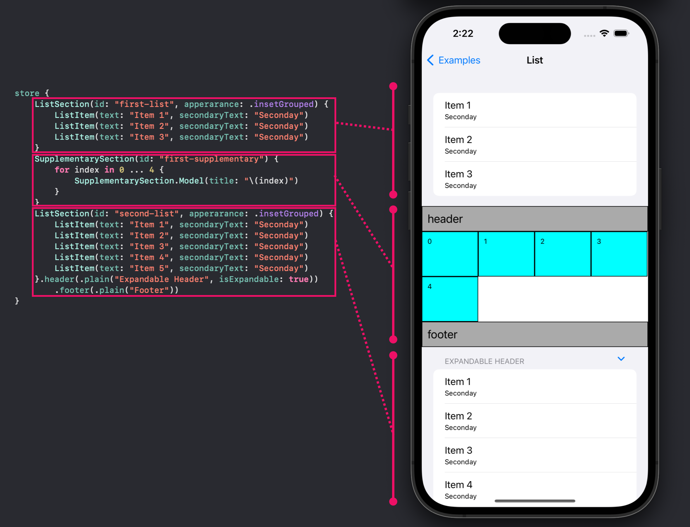

# CollectionComposer

Declaretive collection view layout library for implementing complex collection view.

[](https://swift.org/package-manager/)
[](https://opensource.org/licenses/mit)



## Installation

```swift
dependencies: [
    .package(name: "CollectionComposer", url: "https://github.com/0x0c/CollectionComposer.git", from: "1.0.0"),
    /// ...
]
```

## Usage

### 1. Declare `Section`, `Item` and `Cell`

```
class SampleSection: Section {
    // MARK: Lifecycle

    init(id: String, @ItemBuilder<Item> items: () -> [Item]) {
        self.id = id
        self.items = items()
    }

    let cellRegistration: UICollectionView.CellRegistration<TextCell, Model>! = UICollectionView.CellRegistration<TextCell, Model> { cell, _, model in
        cell.label.text = model.title
        cell.contentView.backgroundColor = .cyan
    }

    // MARK: Internal

    typealias Cell = TextCell
    typealias Item = Model

    struct Model: Hashable {
        let title: String

        let identifier = UUID()

        func hash(into hasher: inout Hasher) {
            hasher.combine(identifier)
        }
    }
}
....
```


```
class TextCell: UICollectionViewCell {
    // MARK: Lifecycle

    override init(frame: CGRect) {
        super.init(frame: frame)
        label.translatesAutoresizingMaskIntoConstraints = false
        label.adjustsFontForContentSizeCategory = true
        contentView.addSubview(label)
        label.font = UIFont.preferredFont(forTextStyle: .caption1)
        let inset = CGFloat(10)
        NSLayoutConstraint.activate([
            label.leadingAnchor.constraint(equalTo: contentView.leadingAnchor, constant: inset),
            label.topAnchor.constraint(equalTo: contentView.topAnchor, constant: inset)
        ])
    }

    @available(*, unavailable)
    required init?(coder: NSCoder) {
        fatalError("not implemnted")
    }

    // MARK: Internal

    static let reuseIdentifier = "text-cell-reuse-identifier"

    let label = UILabel()
}
```

### 2. Declare layout of cells in `Section`

```
func layoutSection(for environment: NSCollectionLayoutEnvironment) -> NSCollectionLayoutSection {
    let itemSize = NSCollectionLayoutSize(
        widthDimension: .fractionalWidth(0.25),
        heightDimension: .fractionalHeight(1.0)
    )
    let item = NSCollectionLayoutItem(layoutSize: itemSize, supplementaryItems: [])
    let groupSize = NSCollectionLayoutSize(
        widthDimension: .fractionalWidth(1.0),
        heightDimension: .fractionalWidth(0.2)
    )
    let group = NSCollectionLayoutGroup.horizontal(layoutSize: groupSize, subitems: [item])
    let section = NSCollectionLayoutSection(group: group)

    return section
}
```

### 3. Load sections in ViewController that inherits ComposedCollectionViewController

```

class ViewController: ComposedCollectionViewController, SectionProvider, SectionDataSource {
...
    // Confirm SectionProvider and SectionDataSource protocol
    // to assign self as a data source of ComposedCollectionViewController
    lazy var sectionDataSource: CollectionComposer.SectionDataSource = self

    private(set) var sections = [any Section]()

    store {
        SampleSection(id: "first") {
            SampleSection.Model(tilte: "Item 1")
            SampleSection.Model(tilte: "Item 2")
            SampleSection.Model(tilte: "Item 3")
            SampleSection.Model(tilte: "Item 4")
        }
    }
...
}
```

See also the example project for undestanding usage of this library.